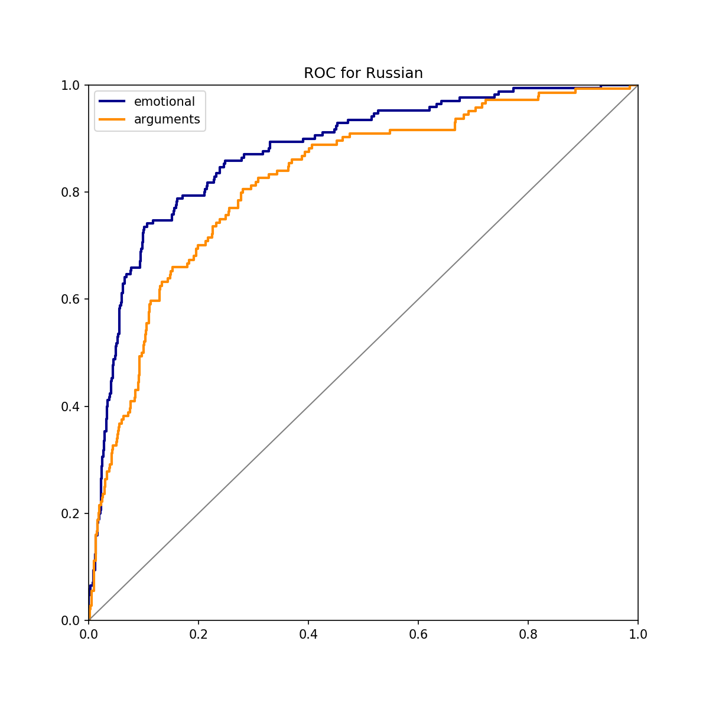
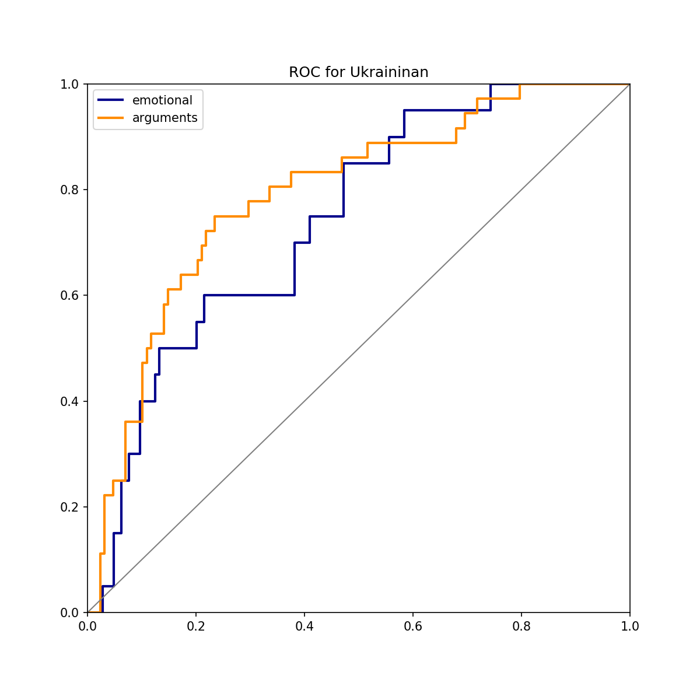

## Texty manipulative news project - methodology

### Repository structure
* [`classifier`](/classifier) - scripts for training and applying language model classifier
* [`data_collection`](/data_collection) - scripts to load RSS feeds, Facebook feeds of selected sites, and scrapy project to load html for each article
* [`data_processing`](/data_processing) - scripts to prepare data for classifier
* [Aggregated ranking](https://docs.google.com/spreadsheets/d/114Anuo8eREUVj3LscPaZcQ7fpvIzxti_virynhUVftI/edit#gid=0) - grouped results for the whole database of news. In final product we do not consider Russian sites, big Ukrainian sites, and sites with less than 25% of manipulative news
* `.._annotation.csv` - annotated sample of news htmls. `html_id` - key id of article in data file, other columns - annotations
* [`cls_tool`](/cls_tool) - Django site for annotation

### Table of contents
 1. [Data](#data)
 2. [Annotation](#annotation)
 3. [Classification](#classification)
 4. [Final ranking](#final-ranking)

### Data
Scripts for data collection and their description are in [`data_collection`](/data_collection) folder. 

Data can be downloaded [here](http://texty.org.ua/d/2018/share/mnews/data_to_publish.jl.zip)(2Gb). `html_id` - key field, `ra_summary` - readability html of article page, `real_url` - link to article. 

Totally we collected 306 500 articles in Ukrainian and 2 301 000 articles in Russian. Next we filtered out articles not about Ukrainian politics and society (excluded celebrities, international news etc.). There were left 1 174 000 relevant articles in Russian and 227 400 articles in Ukrainian. Websites in final ranking totally produced 289 300 relevant articles.

Data for the project are news from around 200 websites, collected from December 2017 until Nowember 2018. For each site we collected RSS feed every hour as well as daily Facebook feeds. Breaks occured several times because of technical reasons. 

For every link from RSS or Facebook feed of site's page we downloaded full text and processed it using readability (by [Mozilla](https://github.com/mozilla/readability), and [Python readability](https://pypi.org/project/readability-lxml)) algorithm. Readability parsing errors occure in less than 5% of cases, without significant error rate for individual websites. Next we removed html tags and tokenized text.

### Annotation
Please find annotation tool in [`annotator`](/annotator) folder. 
We invited journalists with experience as newsfeed editor to label training set for training. Totally we collected 1300 relevant annotated articles in Ukrainian and 6000 in Russian. 
All annotators were interviewed, instructed about possible labels of manipulative news. During annotation we maintained Facebook group to discuss uncertainties and labeling in general. We controlled annotation quality by monitoring labels and time intervals between annotation (if time between two labels is enough to read the article). 
Inintially we used the following labels for annotation, text exactly as it was written in annotator instruction:

1. **Повністю вигадана новина**  
Текст містить вочевидь неправдиві факти з метою ввести читача в оману, нав’язати спотворене уявлення про світ. Фейкова новина в класичному розумінні, брехня.  
До цього типу новин можна віднести відірвану від реальності російську пропаганду, на кшталт “У демократичній ДНР виявили українських диверсантів”, або “Експерти надають докази того, що люди на Майдані самі стріляли одне в одного аби привернути увагу”.

2. **Маніпулятивний заголовок / клікбейт**  
Тексти, що містять надемоційну лексику або обіцяють сенсацію в заголовку.  
Також випадки, коли заголовок надто перебільшує суть тексту або не пов’язаний за змістом з основним повідомленням.  Тексти цього типу часто відрізняє специфічна лексика: “Ви не повірите”, “Виявилось, що”, “СЕНСАЦІЯ”, “Читати всім!”, “Стало відомо”, “шокуюча правда”.  

3. **Конспірологія / Псевдонаука**  
Пояснення подій і явищ недоведеними фактами. Теорії змови, що вказують на існування непідконтрольних нам, вищих і могутніх сил або груп, які впливають на життя - інопланетяни, тотальне прослуховування ЦРУ, тощо.  
Надається інша, альтернативна версія подій, яка підкріплена сумнівними доказами і, за великим рахунком, суперечить здоровому глузду. На кшталт американці не були на Місяці, або Земля пласка.  
Зверніть увагу, що політичні змови виведено в окрему категорію!  
Псевдонаука - імітація науково доведених фактів, зокрема, через використання наукового стилю в тесті. До цієї категорії можна віднести тексти про те, що щеплення смертельно небезпечні і придумані фармо-компаніями, щоб збагатитися; що комп’ютери Фейсбуку почали спілкуватися між собою незрозумілою людям мовою  і так далі і так далі.  

4. **Емоційно упереджена новина**  
Без явного перекручування фактів текст намагається сформувати у читача певний погляд на описані події чи явища, викликати в нього певні емоції і наштовхнути на певні висновки.  
Емоційне упередження створюється з використанням відповідної лексики, зокрема, перебільшень або негативно забарвлених слів. Основна мета тексту не інформувати, а переконати у чомусь.  

5. **Хибна аргументація**  
У тексті порушено логічний зв’язок між тезою та аргументами, встановлені хибні причинно-наслідкові чи асоціативні зв’язки. Наприклад, “кредити МФВ розкрадаються ще до того, як приходять в Україну”.  
До нелогічної аргументації належать випадки, коли замість аргументів звертаються до абстрактних “загальновідомих” речей: “не секрет, що корупція виросла в десятки разів” (без посилання на джерело й методику вимірювання).  
Неповна аргументація - коли автори наводять лише вигідні їм факти; ті, що підтверджують тезу матеріалу - теж означає належність до цього типу. Наприклад, “за новим законом про ЖКГ і так злиденних українців змусять платити пеню”, а те, що відсоток пені дуже низький і в законі є багато норм, які розширюють права мешканців, не вказано.  
До цієї категорії належать і упереджені псевдоаналітичні матеріали. Різновид:  у тексті може бути кілька правдивих фактів або дійсних експертних думок. Проте на їх основі робляться некоректні або непідтверджені висновки. Факт використовують як прикриття суб’єктивної думки автора. Часто в такому тексті також зустрічається  додумування та емоційне перекручування фактів.  
6. **Політичні змови**  
Тексти, що описують певні кулуарні, таємні домовленості між публічними персонами з метою дискредитувати одну зі сторін або підірвати залишки довіри до політичної системи.  
Від справжньої політичної аналітики такі тексти відрізняються надуманістю і часто умисно заплутаною аргументацією.  
Інформація може подаватися як інсайдерська. На кшталт “політик А дає хабарі антикорупціонеру Б, бо звідки ж іще у Б з’явився новий опель? політик А, до речі, ходив у дитсадок, де бабуся антикорупціонера Б була подругою виховательки”. Або тексти про таємні домовленості щодо кредитів МВФ, які ні в якому разі не можна оприлюднювати.  
Часто такий тип зустрічається у статтях про міжнародні відносини, де нав’язують зовнішніх ворогів, кажуть про таємні домовленості і змови як дійсність, без доведення фактів.

7. **Нормальний текст**  
В тексті не викривлюють факти, немає образливих висловлювань на адресу тих чи інших груп, не намагаються викликати емоції. Аргументація логічна, експерти відомі і висловлюють логічні та раціональні аргументи.  

8. **Інше**  
Тексти, що не містять фактів/думок про внутрішню або зовнішню політичну ситуацію, не є актуальними в українському контексті, не містять конспірології. Спорт, світське життя, технології, кримінальна хроніка, милі тваринки, пости в блогах і місцеві новини. Внутрішня російська пропаганда, російська пропаганда, спрямована на треті країни.  
До неактуальних відносяться тексти, які не стосуються України. Приміром, внутрішні  новини РФ про міжнародні візити посадовців або місцеві події. Міжнародні новини, в яких немає згадок про Україну, теж відносяться до “інше”. 

Finally we detected only emotional manipulations and manipulative arguments. The notion of clickbait headlines turned to be ambiguous and we did not manage to build working classifier for this type of manipulation. The rest of manipulations occured rarely and there were not enough positive examples for training.

### Classification 

[`classifier`](/classifier) folder containes links to pretrained models, classification scripts, instructions on how to download libraries, and test datasets. 

We tried various NLP approaches to detect manipulation in news: bag-of-words and document vectors machine learning models, and LSTM on word vectors. Finally we used text classification with language model developed by [fast.ai](http://nlp.fast.ai/classification/2018/05/15/introducting-ulmfit.html). Code for training language models on Wikipedia corpus can be found [here](https://github.com/fastai/fastai/tree/master/courses/dl2/imdb_scripts). 

We used example code from [fast.ai course](https://github.com/fastai/fastai/blob/master/courses/dl2/imdb.ipynb)to train classifiers and found most of defaults working best for our data. We increased dropouts for training Ukrainian language classifier and added multilabel final layer to detect multiple manipulation types at once (multilabel classifier was as accurate as individual classifiers for each manipulation type or better).

Language model containes:
1. input layer of vocabulary size (up to 60 000 tokens that occur more than 10 times)
2. Embedding layser of size 400
3. 3 LSTM layers of 1150 cells each
4. Model output is the result of "concat pooling": last hidden LSTM state, max-pooling of LSTM states, and average LSTM state, up to `bptt` last activations. The size of LM output is 3 * embedding size 

Final feedforward layer for language model training is prediction of the news word. 
For classification we change the last layer to feedforward network with 50 and the 2 cells, since we have 2 categories to classify. In classification we changed default categorical cross-entropy loss to binary cross-entropy, and softmax activation to sigmoid in order to perform multilabel classification.

#### You can download and use all models according to project's license
* [Wikipedia language model for Russian, forward LSTM](http://texty.org.ua/d/2018/share/mnews/fwd_ru_lm.zip)
* [Wikipedia language model for Ukrainian, forward LSTM](http://texty.org.ua/d/2018/share/mnews/fwd_uk_lm.zip)
* [Finetuned on news corpus Wikipedia language model for Russian](http://texty.org.ua/d/2018/share/mnews/fwd_ru_finetuned_lm.zip)
* [Finetuned on news corpus Wikipedia language model for Ukrainian](http://texty.org.ua/d/2018/share/mnews/fwd_uk_finetuned_lm.zip)
* [Finetuned on news corpus Wikipedia language model for Russian, encoder only](http://texty.org.ua/d/2018/share/mnews/fwd_ru_finetuned_lm_enc.zip)
* [Finetuned on news corpus Wikipedia language model for Ukrainian, encoder only](http://texty.org.ua/d/2018/share/mnews/fwd_uk_finetuned_lm_enc.zip)
* [Classifier of relevant news in Russian](http://texty.org.ua/d/2018/share/mnews/ru_is_other_cls.zip)
* [Classifier of relevant news in Ukrainian](http://texty.org.ua/d/2018/share/mnews/uk_is_other_cls.zip)
* [Classifier of types of manipulation for Russian](http://texty.org.ua/d/2018/share/mnews/ru_arg_emo_cls.zip)
* [Classifier of types of manipulation for Ukrainian](http://texty.org.ua/d/2018/share/mnews/uk_emo_arg_cls.zip)

### Final ranking

in final ranking we left only sites with more than 200 relevant news and more that 25% of manipulative news. It is simple aggregation of classification results. 

Values of classifier prediction:

| Type              | Uk       | Ru     |
|-------------------|----------|--------|
| relevance         | < 0.55   | < 0.67 |
| emotional         | > 0.34   | > 0.36 |
| arguments         | > 0.5    | > 0.55 |

ROC-curves for classifiers (built on validation set):

